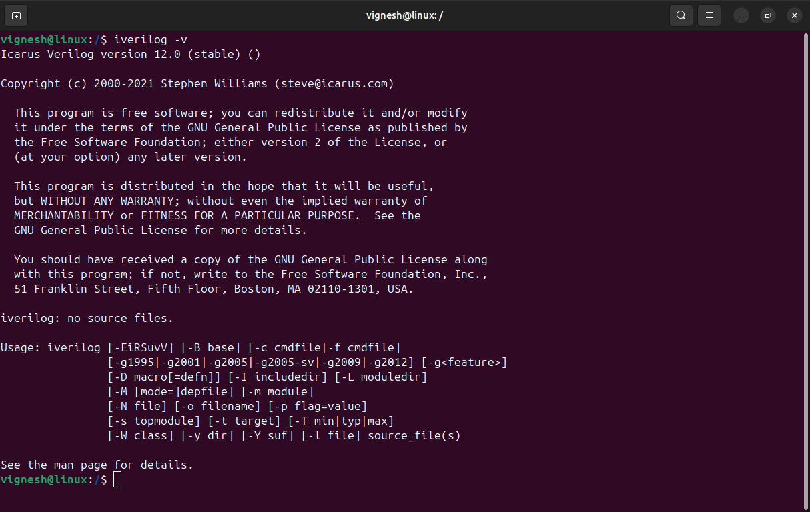

# 🚀 Week 0: RISC-V SoC Design Program Foundation & Tool Setup

Welcome to my **RISC-V System-on-Chip (SoC) Design** journey!  
Week 0 is focused on setting up the development environment and installing the essential open-source tools for digital design and verification.

---

## 🎯 **System & Environment Setup**

Recommended system configuration for efficient work:

<div align="center">

| **Specification** 💻    | **Details** 📋     |
|------------------------|-------------------|
| **Operating System** 🐧 | Ubuntu 22.04+     |
| **RAM** 💾              | 8GB               |
| **Storage** 💿          | 60GB SSD          |
| **vCPUs** ⚡            | 4                 |

</div>

---

## ⚙️ **Essential Tool Installation**

Below are the installation steps and verification for the three key EDA tools:

<div align="center">

```
🧠 Yosys → 📟 Iverilog → 📊 GTKWave
```

</div>

---

### 🧠 **1. Yosys – RTL Synthesis**

**Purpose:** Synthesize Verilog RTL into gate-level netlists.

**Installation:**
```bash
git clone https://github.com/YosysHQ/yosys.git
cd yosys
sudo apt-get install make build-essential clang bison flex libreadline-dev gawk tcl-dev libffi-dev git graphviz xdot pkg-config python3 libboost-system-dev libboost-python-dev libboost-filesystem-dev zlib1g-dev
make
sudo make install
```

**Verification:**
```bash
yosys
```
<p align="center">
  
</p>

<div align="center">
✅ <b>Yosys Successfully Installed</b>
</div>

---

### 📟 **2. Iverilog – Verilog Simulator**

**Purpose:** Simulate and verify digital logic designs.

**Installation:**
```bash
sudo apt-get install iverilog
```

**Verification:**
```bash
iverilog -v
```
<p align="center">
  
</p>

<div align="center">
✅ <b>Iverilog Successfully Installed</b>
</div>

---

### 📊 **3. GTKWave – Waveform Viewer**

**Purpose:** Visualize simulation results and debug digital designs.

**Installation:**
```bash
sudo apt-get install gtkwave
```

**Verification:**
```bash
gtkwave
```
<p align="center">
  
</p>

<div align="center">
✅ <b>GTKWave Successfully Installed</b>
</div>

---

<div align="center">

### 🚀 **Your RISC-V SoC development environment is ready!**

**📂 Repository:** [vignesh_RISC-V-Project](https://github.com/vignesh845/vignesh_RISC-V-Project)  
**👨‍💻 Author:** [vignesh845](https://github.com/vignesh845)

[](https://github.com/vignesh845)
[](https://github.com/vignesh845/vignesh_RISC-V-Project)

</div>

---

*Feel free to update this README with more steps or notes as your setup evolves!*